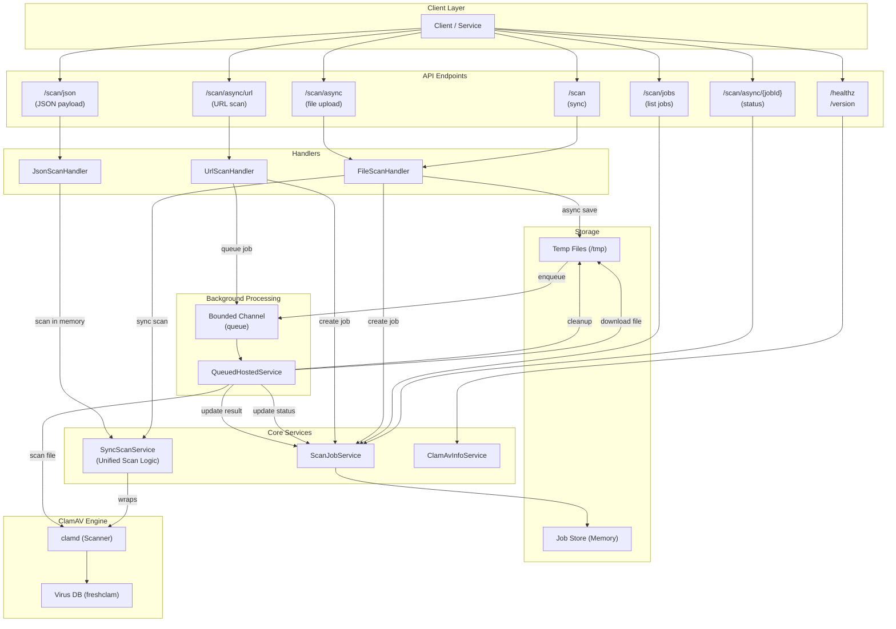

# 🛡️ Arcus ClamAV API Container

A self-contained Dockerised antivirus scanning service built on **ClamAV** with a lightweight **.NET 10 HTTP API** and **Swagger UI**.

This container runs the ClamAV engine and exposes a simple REST API for uploading and scanning files.  
It’s designed for local development, testing, and service integration — all without needing to install ClamAV manually.

---

## 🚀 Features

- 🧩 **All-in-one container** – ClamAV + REST API + Swagger.
- 🔐 **Azure AD Authentication** – Secured with OAuth 2.0 client credentials flow.
- 🔄 **Automatic virus database updates** at start-up (background by default when local signatures already exist).
- 🛡️ **Extended community signatures (best-effort)** – `sanesecurity/rogue.hdb` is configured; if the community mirror is temporarily unavailable, startup continues with available ClamAV signatures.
- 🧠 **Swagger UI** for easy manual testing (`/swagger`) with OAuth2 support - **disabled by default in Docker** (enabled for local development).
- 💬 **Endpoints** for scanning, health checks, and ClamAV version info.
- ⚡ **Async scanning support** – Upload large files and poll for results (ideal for files >10MB).
- 🌐 **URL scanning** – Download and scan files from URLs with Base64 support.
- 📦 **JSON payload scanning** – Automatically detects and scans base64-encoded content within JSON (perfect for Azure Logic Apps & Functions).
- 🎯 **Performance optimized** – Tuned ClamAV settings + 4 concurrent workers for parallel processing.
- 💾 **Persistent database volume** so virus definitions are reused between restarts.
- 🔒 **Stateless HTTP interface** – ideal for CI pipelines or microservices.

---

## 🏗️ Architecture Diagram



### Flow Descriptions

**Synchronous Scan Flow:**
1. Client uploads file to `/scan`
2. FileScanHandler calls SyncScanService (unified scan logic)
3. SyncScanService scans with ClamAV and returns standardized result
4. Returns result (clean/infected/error)

**Asynchronous File Upload Flow:**
1. Client uploads file to `/scan/async`
2. File saved to temp storage
3. Job created with "queued" status
4. Job ID returned immediately
5. Background service picks up job
6. Status: queued → scanning → clean/infected/error
7. Client polls `/scan/async/{jobId}` for status

**Asynchronous URL Download Flow:**
1. Client sends URL (optional Base64) to `/scan/async/url`
2. Job created with "downloading" status
3. Job ID returned immediately
4. Background service downloads file
5. Status: downloading → scanning → clean/infected/error
6. Client polls `/scan/async/{jobId}` for status

---

## 📁 Project Structure

```
.
├── Dockerfile                          # Builds .NET API + installs ClamAV
├── docker-compose.yml                  # Runs the container locally
├── scripts/
│   └── start.sh                        # Starts ClamAV & the API
├── conf/
│   ├── clamd.conf                      # ClamAV daemon configuration
│   └── freshclam.conf                  # Freshclam configuration
└── src/
    └── Arcus.ClamAV/               # .NET 10 API project
        ├── Program.cs                  # Application entry point & DI configuration
        ├── Endpoints/                  # Endpoint route definitions
        │   ├── HealthEndpoints.cs      # Health check & version endpoints
        │   └── ScanEndpoints.cs        # All scan-related endpoints
        ├── Handlers/                   # Business logic handlers
        │   ├── FileScanHandler.cs      # Handles file upload scans
        │   ├── JsonScanHandler.cs      # Handles JSON payload scans
        │   └── UrlScanHandler.cs       # Handles URL download scans
        ├── Services/                   # Background & domain services
        │   ├── SyncScanService.cs          # Unified scan logic for handlers
        │   ├── QueuedHostedService.cs      # Background job processor
        │   ├── ScanProcessingService.cs    # Shared async processing logic
        │   ├── ScanJobService.cs           # Job tracking & management
        │   └── ClamAvInfoService.cs        # ClamAV version info
        └── Models/                     # Data models
            ├── ScanJob.cs              # Job tracking model
            └── ScanUrlRequest.cs       # URL scan request model
```

---

## 🧰 Prerequisites

- [Docker Desktop](https://www.docker.com/products/docker-desktop/) (or Docker Engine + Compose plugin)
- Optional: `curl` for testing from the command line

---

## 🧱 Build and Run Locally

From the project root, run:

```bash
docker compose up -d --build
```

This will:
1. Build the image from the local `Dockerfile`
2. Start the container
3. Expose the API on **http://localhost:8080**

---

## 🌐 API Endpoints

| Method | Endpoint | Description |
|:-------|:----------|:-------------|
| `GET` | `/healthz` | Health check – verifies both API and ClamAV daemon are ready (returns `200` if both ready, `503` if ClamAV not responding) |
| `GET` | `/version` | Returns ClamAV version information |
| `POST` | `/scan` | Upload a file to scan for viruses (synchronous - waits for results) |
| `POST` | `/scan/async` | Upload a file for async scanning (returns job ID immediately) |
| `POST` | `/scan/async/url` | Download a file from URL and scan it asynchronously (with size validation) |
| `POST` | `/scan/json` | Scan a JSON payload with automatic base64 detection (perfect for Azure integrations) |
| `GET` | `/scan/async/{jobId}` | Check status of an async scan job |
| `GET` | `/scan/jobs` | List recent scan jobs (for monitoring) |
| `GET` | `/swagger` | OpenAPI documentation & interactive UI |


## 🔍 Test Examples

### 🧪 Via Swagger UI

**Note:** Swagger UI is **disabled by default** in the Docker image (`ENABLE_SWAGGER=false`).

In this repository, `docker-compose.yml` builds with `ENABLE_SWAGGER=true`, so Swagger is available when you run:
```bash
docker compose up -d --build
```

To run with Swagger explicitly via `docker run`, build with the arg and run the image:
```bash
docker build --build-arg ENABLE_SWAGGER=true -t clamav-api:swagger .
docker run --rm -p 8080:8080 clamav-api:swagger
```

Once enabled, open **[http://localhost:8080/swagger](http://localhost:8080/swagger)** in your browser.  
You'll see interactive endpoints — you can upload files directly under `/scan` or `/scan/async`.

---

### 🧾 Via `curl`

#### 1️⃣ Clean file (Synchronous)
```bash
echo "hello" > clean.txt
curl -F "file=@clean.txt" http://localhost:8080/scan
```

Expected response:
```json
{ "status": "clean", "engine": "clamav", "fileName": "clean.txt", "size": 6, "scanDurationMs": 123.4 }
```

#### 2️⃣ EICAR test virus (Synchronous)
```bash
echo "X5O!P%@AP[4\PZX54(P^)7CC)7}$EICAR-STANDARD-ANTIVIRUS-TEST-FILE!$H+H*" > eicar.txt
curl -F "file=@eicar.txt" http://localhost:8080/scan
```

Expected response:
```json
{ "status": "infected", "malware": "Win.Test.EICAR_HDB-1", "engine": "clamav", "fileName": "eicar.txt", "size": 68, "scanDurationMs": 234.5 }
```

#### 3️⃣ Large file (Asynchronous)
```bash
# Upload file
curl -X POST http://localhost:8080/scan/async -F "file=@large-file.zip"

# Returns immediately with:
# { "jobId": "abc-123", "status": "queued", "statusUrl": "/scan/async/abc-123" }

# Check status (poll until complete)
curl http://localhost:8080/scan/async/abc-123
```

#### 🏥 Health Check
```bash
# Check if API and ClamAV daemon are ready
curl http://localhost:8080/healthz
```

Expected response (when ready):
```json
{ "status": "ok" }
```

Returns `503 Service Unavailable` if ClamAV daemon is not responding yet.

#### 4️⃣ Scan file from URL (Asynchronous)
```bash
# Scan a file from URL
curl -X POST http://localhost:8080/scan/async/url \
  -H "Content-Type: application/json" \
  -d '{"url": "https://example.com/documents/report.pdf"}'

# Scan with Base64 encoded URL
curl -X POST http://localhost:8080/scan/async/url \
  -H "Content-Type: application/json" \
  -d '{"url": "aHR0cHM6Ly9leGFtcGxlLmNvbS9kb2N1bWVudHMvcmVwb3J0LnBkZg==", "isBase64": true}'

# Returns immediately with:
# { "jobId": "def-456", "status": "downloading", "statusUrl": "/scan/async/def-456", "sourceUrl": "https://example.com/documents/report.pdf" }

# Check status (poll until complete)
curl http://localhost:8080/scan/async/def-456
```

💡 **URL Scanning Features:**
- **Request Format**: JSON body with `url` property and optional `isBase64` flag
- **Base64 Support**: Set `isBase64` to `true` if URL is Base64 encoded
- **Original Filenames**: Preserves the original filename from the URL
- **Async Download**: Returns job ID immediately, download happens in background
- **Status Tracking**: Use "downloading" → "scanning" → "clean"/"infected"/"error" status flow
- **Size Validation**: Checks `Content-Length` header before downloading (if available)
- **Real-time Monitoring**: Monitors download size in real-time if `Content-Length` is not available
- **Auto-cleanup**: Cancels download and deletes partial file if size limit is exceeded

💡 *Note: Your local antivirus may delete the EICAR test file immediately – that's normal.*

💡 *For large files (>10MB), use the async endpoints for better performance.*

---
## 📦 JSON Payload Scanning (Azure Integration)

The `/scan/json` endpoint is designed for Azure Logic Apps, Functions, and Power Automate integrations where file content is often embedded as base64 within JSON messages. The endpoint scans the **entire JSON body** for malware.

### How It Works

1. Send any JSON payload to `/scan/json`
2. The API recursively searches through all JSON properties for base64-encoded content
3. Any property containing base64-encoded data is automatically detected and decoded
4. Each decoded item is scanned for malware
5. All other plaintext string values are also scanned (except those already identified as base64)
6. Returns comprehensive results with details about each scanned item
7. Returns 406 if malware is detected in any item; 200 if all items are clean

### Example 1: Raw JSON (Recommended)

Send raw JSON directly — the API scans everything:

```bash
curl -X POST http://localhost:8080/scan/json \
  -H "Content-Type: application/json" \
  -d '{
    "messageId": "abc-123",
    "timestamp": "2024-01-01T10:00:00Z",
    "sender": "user@example.com",
    "attachment": {
      "fileName": "document.pdf",
      "contentBytes": "JVBERi0xLjQKJeLjz9MKMSAwIG9iago8PC9UeXBlL0NhdGFsb2cvUGFnZXMgMiAwIFI+PgplbmRvYmoKMiAwIG9iago8PC9UeXBlL1BhZ2VzL0tpZHNbMyAwIFJdL0NvdW50IDE+PgplbmRvYmoKMyAwIG9iago8PC9UeXBlL1BhZ2UvUGFyZW50IDIgMCBSPj4KZW5kb2JqCnhyZWYKMCA0CjAwMDAwMDAwMDAgNjU1MzUgZgowMDAwMDAwMDE1IDAwMDAwIG4KMDAwMDAwMDA2MCAwMDAwMCBuCjAwMDAwMDAxMTUgMDAwMDAgbgp0cmFpbGVyPDwvUm9vdCAxIDAgUi9TaXplIDQ+PgpzdGFydHhyZWYKMTY1CiUlRU9G"
    }
  }'
```

Response:
```json
{
  "status": "clean",
  "itemsScanned": 3,
  "base64ItemsFound": 1,
  "scanDurationMs": 145.7,
  "details": [
    {
      "name": "attachment.contentBytes",
      "type": "base64_decoded",
      "size": 165,
      "status": "clean"
    },
    {
      "name": "sender",
      "type": "plaintext",
      "size": 18,
      "status": "clean"
    },
    {
      "name": "messageId",
      "type": "plaintext",
      "size": 7,
      "status": "clean"
    }
  ]
}
```

### Example 2: Detection of Malware at Root Level

The API scans all properties, including root-level ones:

```bash
curl -X POST http://localhost:8080/scan/json \
  -H "Content-Type: application/json" \
  -d '{
    "data": "X5O!P%@AP[4\\PZX54(P^)7CC)7}$EICAR-STANDARD-ANTIVIRUS-TEST-FILE!$H+H*",
    "metadata": "clean"
  }'
```

Response (HTTP 406 Infected):
```json
{
  "status": "infected",
  "malware": "Win.Test.EICAR_HDB-1",
  "infectedItem": "data",
  "itemsScanned": 2,
  "base64ItemsFound": 0,
  "scanDurationMs": 89.3,
  "details": [
    {
      "name": "data",
      "type": "plaintext",
      "size": 68,
      "status": "infected",
      "malware": "Win.Test.EICAR_HDB-1"
    }
  ]
}
```

### What Gets Detected as Base64?

The API uses smart detection:
- **Minimum length**: 20 characters (avoids false positives)
- **Character set**: Only valid base64 characters (A-Z, a-z, 0-9, +, /, =)
- **Proper format**: Correct padding and length (multiple of 4)
- **Validation**: Successfully decodes to at least 10 bytes without errors
- **No double-scan**: Plaintext strings identified as base64 are not scanned again as plaintext

### Benefits for Azure Integrations

✅ **No pre-processing needed** – Send Logic App output directly  
✅ **Multi-file support** – Scans all base64 properties in arrays/nested objects  
✅ **Multi-type scanning** – Scans decoded binaries AND plaintext values  
✅ **Clear results** – Know exactly which item was infected and its type  
✅ **Flexible structure** – No required JSON schema  
✅ **Efficient** – Avoids double-scanning properties already decoded as base64

### Example: Multiple Attachments

```bash
curl -X POST http://localhost:8080/scan/json \
  -H "Content-Type: application/json" \
  -d '{
    "payload": {
      "email": {
        "subject": "Monthly Report",
        "attachments": [
          {
            "name": "report.pdf",
            "data": "[base64 content...]"
          },
          {
            "name": "data.xlsx",
            "data": "[base64 content...]"
          }
        ]
      }
    }
  }'
```

The API will find and scan both `attachments[0].data` and `attachments[1].data`, as well as plaintext values like `subject`.

---

## 🧩 ClamAV Version Endpoint

To check the currently loaded ClamAV version information:

```bash
curl http://localhost:8080/version
```

Example:
```json
{
  "clamAvVersion": "ClamAV <engine>/<database-version>/<database-date>"
}
```
---

## 💾 Persistent Virus Database

The container uses a named Docker volume (`clamav-db`) to persist the ClamAV signature database.  
This prevents full re-downloads every time the container starts.

To clear it manually:
```bash
docker compose down -v
```

---

## ⚙️ Configuration

Environment variables can be overridden in `docker-compose.yml`:

| Variable | Default | Description |
|-----------|----------|-------------|
| `CLAMD_HOST` | `127.0.0.1` | ClamAV daemon host |
| `CLAMD_PORT` | `3310` | ClamAV daemon port |
| `MAX_FILE_SIZE_MB` | `200` | Max upload size |
| `ASPNETCORE_ENVIRONMENT` | `Production` | .NET environment name |
| `AzureAd__TenantId` | - | Azure AD Tenant ID |
| `AzureAd__ClientId` | - | Azure AD Application (client) ID |
| `AzureAd__Audience` | - | API audience (usually `api://{ClientId}`) |
| `Swagger__Enabled` | `false` | Enable Swagger UI and OpenAPI documentation |
| `Base64Detection__Enabled` | `true` | Enable automatic Base64 file content detection |
| `Base64Detection__PeekSizeBytes` | `4096` | Bytes to examine for Base64 detection |
| `FRESHCLAM_BACKGROUND_UPDATE` | `true` | Run `freshclam` in background when local DB files already exist |
| `FRESHCLAM_BLOCKING_ON_EMPTY_DB` | `true` | Run blocking `freshclam` only when no local DB files are found |
| `UPDATE_CA_CERTS_ON_START` | `false` | Refresh CA certificates on container start (normally skipped; done at image build) |
| `FRESHCLAM_DELAY_SECS` | `0` | Optional delay before the initial freshclam update |

---

## 🧹 Stop and Clean Up

```bash
docker compose down
```

To also remove the virus DB volume:
```bash
docker compose down -v
```

---

## ☁️ Azure Container Apps Deployment

Deploy the ClamAV API to Azure Container Apps for production workloads with automatic scaling, managed authentication, and enterprise-grade security.

### 🎯 Why Azure Container Apps?

- **🔐 Built-in Authentication** – Azure AD authentication via EasyAuth (no code changes needed)
- **📈 Automatic Scaling** – HTTP-based scaling up to 30 replicas
- **💰 Cost-Effective** – Scale to zero when idle (dev/staging)
- **🔒 Enterprise Security** – Managed identity, VNet integration, private endpoints
- **📊 Integrated Monitoring** – Log Analytics, Application Insights, metrics
- **🌍 Multi-Region** – Built-in geo-replication support
- **💾 Persistent Storage** – Azure Files for ClamAV database (fast startup)

### 📋 Prerequisites

- Azure subscription with permissions to create resources
- Azure CLI installed (`az --version`)
- Bicep CLI installed (`az bicep version`)
- Azure AD app registration for authentication (or disable for internal use)

### 🚀 Quick Start (3 Steps)

#### 1️⃣ Create Azure AD App Registration (for authentication)

```bash
# Create app registration for authentication
az ad app create --display-name "ClamAV API - Production"

# Get the client ID (save this)
CLIENT_ID=$(az ad app list --display-name "ClamAV API - Production" --query "[0].appId" -o tsv)
echo "Client ID: $CLIENT_ID"
```

#### 2️⃣ Create Resource Group and Deploy Infrastructure

```bash
# Set your parameters
RESOURCE_GROUP="rg-clamav-prod"
LOCATION="eastus"
ENVIRONMENT="prod"

# Create resource group
az group create --name $RESOURCE_GROUP --location $LOCATION

# Deploy infrastructure using Bicep
az deployment group create \
  --resource-group $RESOURCE_GROUP \
  --template-file infra/bicep/main.bicep \
  --parameters environmentName=$ENVIRONMENT \
  --parameters location=$LOCATION \
  --parameters aadClientId=$CLIENT_ID \
  --parameters enableAuthentication=true
```

#### 3️⃣ Build and Push Container Image

```bash
# Get ACR name from deployment output
ACR_NAME=$(az deployment group show \
  --resource-group $RESOURCE_GROUP \
  --name main \
  --query properties.outputs.containerRegistryName.value -o tsv)

# Build and push image to ACR
az acr build \
  --registry $ACR_NAME \
  --image clamav-api:latest \
  --file Dockerfile \
  .

# Container App automatically pulls the new image
```

That's it! Your API is now deployed at the URL shown in the deployment output.

### 🔧 Deployment Options

#### Using Parameter Files (Recommended)

Create a parameter file for your environment:

```bash
# Copy example parameter file
cp infra/bicep/parameters/example.bicepparam infra/bicep/parameters/prod.bicepparam

# Edit with your values
nano infra/bicep/parameters/prod.bicepparam
```

Deploy using the parameter file:

```bash
az deployment group create \
  --resource-group $RESOURCE_GROUP \
  --template-file infra/bicep/main.bicep \
  --parameters infra/bicep/parameters/prod.bicepparam
```

#### Using Existing Container Apps Environment

If you have a shared Container Apps environment:

```bash
az deployment group create \
  --resource-group $RESOURCE_GROUP \
  --template-file infra/bicep/main.bicep \
  --parameters environmentName=$ENVIRONMENT \
  --parameters location=$LOCATION \
  --parameters aadClientId=$CLIENT_ID \
  --parameters useExistingManagedEnvironment=true \
  --parameters existingManagedEnvironmentName="cae-shared-prod" \
  --parameters existingManagedEnvironmentResourceGroup="rg-shared-infrastructure"
```

### 🔐 Authentication

The deployment uses **Azure Container Apps EasyAuth** for zero-code authentication:

- All API endpoints require valid Azure AD tokens
- Authentication handled at platform level (before reaching your app)
- Configure in Bicep with `aadClientId` parameter
- Set `enableAuthentication=false` for internal-only deployments (not recommended for production)

**Testing authenticated endpoints:**

```bash
# Get access token
TOKEN=$(az account get-access-token --resource $CLIENT_ID --query accessToken -o tsv)

# Call API with token
curl -H "Authorization: Bearer $TOKEN" https://your-app.azurecontainerapps.io/healthz
```

### 📊 Monitoring and Logs

**View logs in Azure Portal:**
1. Navigate to your Container App in Azure Portal
2. Select **Log stream** for real-time logs
3. Select **Metrics** for performance monitoring

**Query logs with CLI:**

```bash
# Get Container App logs
az containerapp logs show \
  --name clamav-api-prod \
  --resource-group $RESOURCE_GROUP \
  --follow

# Query Log Analytics
LOG_ANALYTICS_WORKSPACE=$(az deployment group show \
  --resource-group $RESOURCE_GROUP \
  --name main \
  --query properties.outputs.logAnalyticsWorkspaceName.value -o tsv)

az monitor log-analytics query \
  --workspace $LOG_ANALYTICS_WORKSPACE \
  --analytics-query "ContainerAppConsoleLogs_CL | where ContainerAppName_s == 'clamav-api-prod' | order by TimeGenerated desc | take 100"
```

### 📈 Scaling Configuration

Automatic scaling is configured in the Bicep template:

- **HTTP Scaling**: Scales at 20 concurrent requests per replica
- **CPU Scaling**: Scales at 70% CPU utilization
- **Min/Max Replicas**: Configurable (default: 1-5 for prod, 0-2 for dev)

**Adjust scaling:**

```bash
az containerapp update \
  --name clamav-api-prod \
  --resource-group $RESOURCE_GROUP \
  --min-replicas 2 \
  --max-replicas 10
```

### 💾 ClamAV Database Persistence

The deployment uses **Azure Files** to persist the ClamAV virus database (~300MB):

- **Volume Mount**: `/var/lib/clamav` mapped to Azure Files share
- **Fast Startup**: Database persists across restarts (no re-download)
- **Shared Access**: All replicas share the same database
- **Auto-Update**: Container starts with existing signatures and runs updates in parallel by default

Startup behavior can be tuned with environment variables:

- `FRESHCLAM_BACKGROUND_UPDATE` (default: `true`) – Run `freshclam` in background when local DB exists
- `FRESHCLAM_BLOCKING_ON_EMPTY_DB` (default: `true`) – Block startup only when no local DB files are found
- `UPDATE_CA_CERTS_ON_START` (default: `false`) – Skip CA bundle refresh on each boot (already done at image build)

### 🔁 CI/CD with Azure Pipelines

Use the included Azure Pipeline templates for automated deployments:

**Quick setup:**

1. Copy the demo pipeline:
   ```bash
   cp .pipelines/demo-deploy-pipeline.yml azure-pipelines.yml
   ```

2. Update variables in the pipeline:
   - Azure service connection name
   - Resource group names
   - Azure AD client IDs (use variable groups for secrets)

3. Commit and push to trigger deployment

See [`.pipelines/README.md`](.pipelines/README.md) for detailed pipeline documentation.

### 🏗️ Infrastructure Components

The Bicep deployment creates:

- **Azure Container Registry** – Stores container images
- **Storage Account** – Azure Files for ClamAV database
- **Log Analytics Workspace** – Centralized logging (optional: skip if using existing environment)
- **Container Apps Environment** – Managed Kubernetes environment (or use existing)
- **Container App** – Your ClamAV API with auto-scaling and EasyAuth

### 🛠️ Advanced Configuration

**Custom domain:**

```bash
az containerapp hostname add \
  --name clamav-api-prod \
  --resource-group $RESOURCE_GROUP \
  --hostname scan.yourdomain.com
```

**VNet integration:**

```bash
# Add to Bicep parameters
--parameters vnetSubnetId="/subscriptions/{sub-id}/resourceGroups/{rg}/providers/Microsoft.Network/virtualNetworks/{vnet}/subnets/{subnet}"
```

**Increase resources:**

```bash
az containerapp update \
  --name clamav-api-prod \
  --resource-group $RESOURCE_GROUP \
  --cpu 2.0 \
  --memory 4.0Gi
```

### 📝 Detailed Documentation

- **[Azure Deployment Guide](docs/azure-deployment.md)** – Step-by-step deployment walkthrough
- **[Bicep Parameters Guide](infra/bicep/parameters/README.md)** – All configuration options
- **[Azure Pipelines Guide](.pipelines/README.md)** – CI/CD setup and usage
- **[Azure Verified Modules](https://azure.github.io/Azure-Verified-Modules/)** – More about AVM

### 💰 Cost Estimation

Typical monthly costs (eastus region):

- **Development**: ~$5-15/month (scale to zero when idle)
- **Staging**: ~$20-40/month (min 1 replica)
- **Production**: ~$50-150/month (min 2 replicas, depending on load)

Actual costs vary based on:
- Number of active replicas
- CPU and memory allocation
- Storage usage (minimal)
- Data transfer (egress)

Use [Azure Pricing Calculator](https://azure.microsoft.com/pricing/calculator/) for detailed estimates.

---

## 🧠 Useful Notes

- Database updates happen automatically on container start.
- Logs for ClamAV and the API are visible via:
  ```bash
  docker logs -f clamav-api
  ```
- You can safely integrate this service with other apps via HTTP (no local ClamAV needed).

---

## 🧑‍💻 Contributing

1. Fork the repo and make changes in a new branch.  
2. Run `docker compose up -d --build` to test locally.  
3. Submit a PR with a clear description of your change.

---

## 📜 Licence

This project is provided under the MIT Licence.  
ClamAV is licensed separately under the [GNU General Public License (GPL)](https://www.clamav.net/about).

